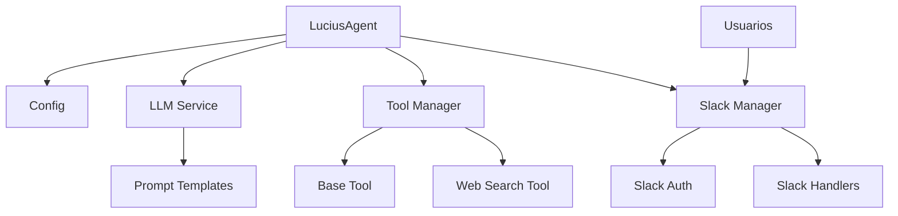

## Arquitectura General del Sistema

Lucius se basa en una arquitectura modular altamente extensible que integra múltiples componentes especializados para proporcionar una solución de IA flexible y adaptable.

## Componentes Principales

### 1. Agente LangChain (LuciusAgent)
- **Propósito:** Orquestación central del sistema de IA
- **Responsabilidades:**
  - Coordinar interacciones entre componentes
  - Gestionar flujo de conversación
  - Manejar ejecución de herramientas
  - Administrar cambios de personalidad
- **Principios de Diseño:**
  - Principio de Responsabilidad Única (SRP)
  - Bajo acoplamiento
  - Alta cohesión

### 2. Servicio LLM
- **Propósito:** Procesamiento de lenguaje natural
- **Componentes:**
  - Modelo Groq Llama
  - Plantillas de Prompts
- **Características:**
  - Generación dinámica de respuestas
  - Adaptación de personalidad
  - Procesamiento contextual

### 3. Gestor de Herramientas (ToolManager)
- **Propósito:** Gestión modular de herramientas
- **Características:**
  - Carga dinámica de herramientas
  - Ejecución flexible
  - Extensibilidad
- **Herramientas Implementadas:**
  - Búsqueda Web (Brave Search)
  - Herramientas de Slack

### 4. Gestor de Slack
- **Propósito:** Integración con plataforma Slack
- **Componentes:**
  - Autenticación Slack
  - Manejadores de Eventos
- **Características:**
  - Comunicación segura via Socket Mode
  - Manejo de eventos de mensaje
  - Integración de herramientas Slack

## Patrones de Diseño Utilizados

### 1. Principio de Responsabilidad Única (SRP)
- **Contexto:** Diseño de componentes
- **Problema:** Evitar clases/módulos con múltiples responsabilidades
- **Solución:** Cada componente tiene una única responsabilidad bien definida
- **Consecuencias:** 
  - Código más mantenible
  - Mayor facilidad de pruebas
  - Mejor extensibilidad

### 2. Patrón de Estrategia
- **Contexto:** Gestión de personalidades y herramientas
- **Problema:** Permitir cambios dinámicos de comportamiento
- **Solución:** Implementación de personalidades y herramientas intercambiables
- **Consecuencias:**
  - Flexibilidad en tiempo de ejecución
  - Fácil adición de nuevas personalidades/herramientas

### 3. Inyección de Dependencias
- **Contexto:** Configuración de componentes
- **Problema:** Reducir acoplamiento entre módulos
- **Solución:** Configuración centralizada en `config.py`
- **Consecuencias:**
  - Mayor modularidad
  - Facilita pruebas
  - Configuración más flexible

## Flujos de Datos Principales
1. Recepción de mensaje de Slack
2. Procesamiento por LuciusAgent
3. Selección de herramienta/personalidad
4. Generación de respuesta con LLM
5. Envío de respuesta a Slack

## Consideraciones de Extensibilidad
- Interfaz base para herramientas
- Configuración dinámica
- Mecanismo de carga de plugins
- Validación y autorización de herramientas

## Mejoras Futuras
- Sistema de plugins más robusto
- Mecanismo de descubrimiento automático
- Interfaz de administración de herramientas
- Sistema de memoria contextual avanzado
