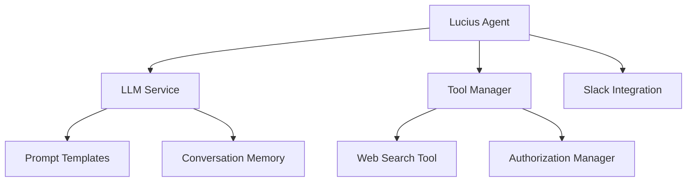

# Patrones de Sistema Lucius

## Arquitectura General

## Componentes Principales

### Lucius Agent
- **Propósito:** Orquestador central del sistema
- **Responsabilidades:**
  - Gestionar flujo de interacciones
  - Coordinar herramientas y servicios
  - Manejar contexto de conversación
- **Interfaces:**
  - Integración con Slack
  - Gestión de herramientas
  - Procesamiento de entrada de usuario

### LLM Service
- **Propósito:** Servicio de procesamiento de lenguaje natural
- **Responsabilidades:**
  - Generar respuestas inteligentes
  - Manejar plantillas de prompts
  - Gestionar historial de conversación
- **Características Clave:**
  - Personalidad de Lucius Fox
  - Detección de idioma
  - Generación de respuestas concisas

### Tool Manager
- **Propósito:** Gestión y coordinación de herramientas
- **Responsabilidades:**
  - Descubrir y registrar herramientas
  - Autorizar y ejecutar herramientas
  - Manejar dependencias entre herramientas
- **Herramientas Implementadas:**
  - Búsqueda web
  - Integración de servicios externos

### Slack Integration
- **Propósito:** Interfaz de comunicación
- **Responsabilidades:**
  - Manejar eventos de Slack
  - Procesar mensajes entrantes
  - Enviar respuestas
- **Características:**
  - Soporte para menciones
  - Manejo de eventos de mensaje
  - Conexión Socket Mode

## Patrones de Diseño

### Principios SOLID Aplicados
1. **Responsabilidad Única (SRP):**
   - Cada módulo tiene una responsabilidad clara
   - Separación de preocupaciones en componentes

2. **Abierto/Cerrado:**
   - Arquitectura modular permite extensión sin modificación
   - Sistema de herramientas extensible

3. **Sustitución de Liskov:**
   - Herramientas y servicios siguen interfaces comunes
   - Intercambiabilidad de componentes

4. **Segregación de Interfaces:**
   - Interfaces específicas para cada tipo de servicio
   - Minimizar dependencias innecesarias

5. **Inversión de Dependencia:**
   - Módulos dependen de abstracciones
   - Inyección de dependencias para flexibilidad

## Flujos de Datos

### Procesamiento de Mensaje
1. Slack recibe mensaje
2. Lucius Agent procesa entrada
3. LLM Service genera respuesta
4. Tool Manager ejecuta herramientas si es necesario
5. Respuesta enviada de vuelta a Slack

### Ejecución de Herramienta
1. Tool Manager recibe solicitud
2. Verifica autorización
3. Ejecuta herramienta específica
4. Devuelve resultados al agente
5. LLM integra resultados en respuesta

## Consideraciones de Extensibilidad
- Arquitectura permite añadir nuevas herramientas fácilmente
- Sistema de plugins planificado para futuras versiones
- Personalidad adaptable mediante configuración de prompts
